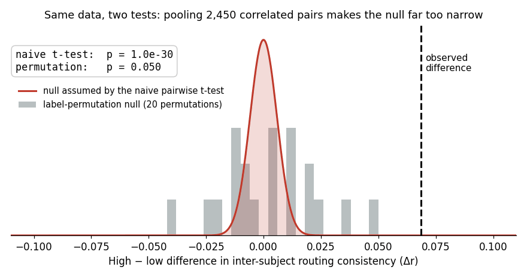
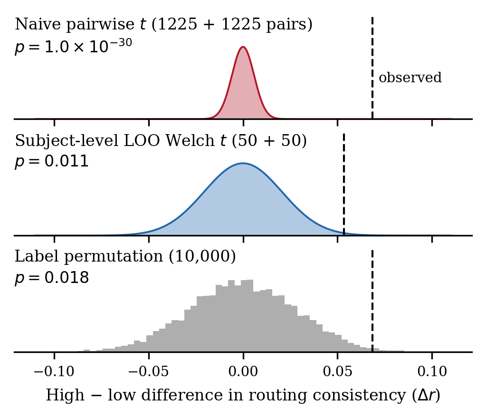
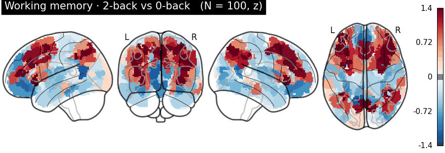
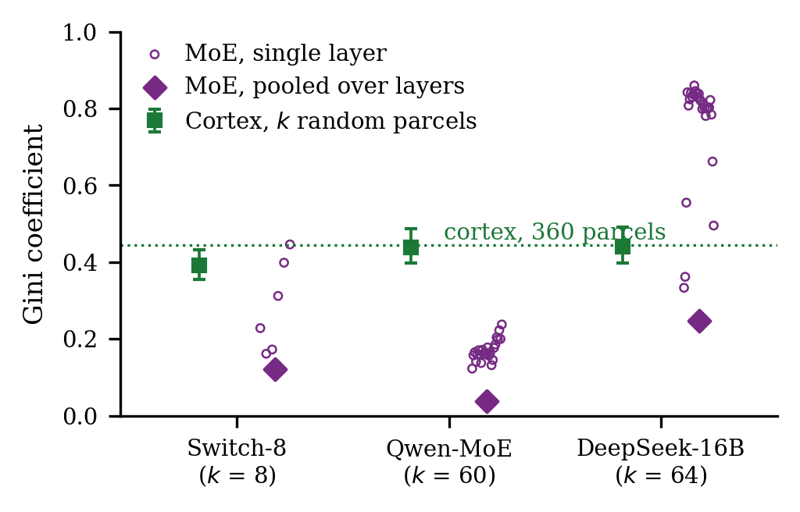
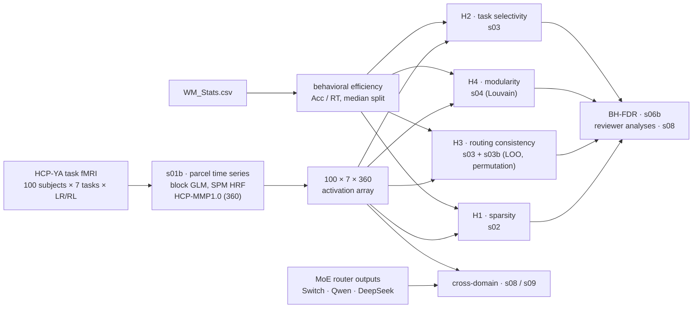

<div align="center">

# Routing-Level Signatures of Cognitive Efficiency

### Only inter-subject routing consistency survives FDR — with a pairwise-correlation caveat

**Xiaoyan Li · Cuicui Jiang · Jiaoping Chen · Yujia Du · Jiaxuan Wei · Xingyue Liu · Rumei Yang**

*IEEE International Conference on Bioinformatics and Biomedicine (BIBM 2026), regular paper*

[](https://www3.cs.stonybrook.edu/~bibm2026/)
[](https://www.humanconnectome.org/study/hcp-young-adult)
[](requirements.txt)
[](LICENSE)



<sub>Same data, two tests. The grey histogram is the label-permutation null for the group difference in routing consistency; the red curve is the null implicitly assumed when all 2,450 within-group pairwise correlations are pooled into a t-test. The observed difference (dashed) sits at p = 0.018 under the first and p = 10<sup>−30</sup> under the second.</sub>

</div>

---

## TL;DR

Do people who solve cognitive tasks efficiently route information through cortex differently? We tested four pre-specified candidate signatures jointly, in one sample of **100 HCP participants across all seven task-fMRI paradigms**, with a behavior-defined efficiency label and Benjamini–Hochberg FDR control.

- ✅ **Inter-subject routing consistency** — high-efficiency participants route task information across networks more like one another (*d* = +0.52, *p*<sub>FDR</sub> = 0.033), confirmed by permutation, rank, continuous-score and Bayesian analyses.
- ❌ **Activation sparsity**, ❌ **canonical task-network engagement**, ❌ **modularity** — not supported.
- ⚠️ **The pairwise-correlation trap** — the test most practitioners reach for reports *p* = 1.0 × 10<sup>−30</sup> on the same consistency data, overstating significance by **~28 orders of magnitude**. A subject-level leave-one-out statistic fixes it in three lines.
- 🤖 **Cortex vs. Mixture-of-Experts** — cortex is ~3.3× more concentrated than MoE expert use *pooled over layers*, but single MoE layers can be more concentrated than cortex: "which is sparser" depends on the level of pooling.

## Key results

| | Candidate signature | Primary outcome (one value per participant) | Effect *d* [95% CI] | *p* | *p*<sub>FDR</sub> | BF<sub>10</sub> | Verdict |
|:-:|---|---|:-:|:-:|:-:|:-:|:-:|
| H1 | Sparser activation | composite sparsity | −0.26 [−0.66, +0.13] | 0.19 | 0.29 | 0.45 | ❌ |
| H2 | Task-selective networks | entropy selectivity (Yeo-7) | +0.14 [−0.26, +0.53] | 0.50 | 0.50 | 0.26 | ❌ |
| **H3** | **Consistent routing** | **subject-level LOO correlation** | **+0.52 [+0.12, +0.92]** | **0.011** | **0.033** | **4.0** | ✅ |
| H4 | More modular | Newman's *Q* (Louvain) | +0.19 [−0.20, +0.59] | 0.34 | 0.34 | 0.32 | ❌ |

H3 also holds under label permutation (*p* = 0.018), Mann–Whitney (*p* = 0.013), with head motion as a covariate (*p* = 0.013), and as a correlation with the continuous efficiency score (*r* = 0.36, *p* = 0.0002). All numbers are in [`results/summary/camera_ready_analyses.json`](results/summary/camera_ready_analyses.json).

## The pairwise-correlation caveat

"Do efficient participants route more similarly?" invites a natural analysis: correlate every pair of participants within a group and *t*-test the two sets of correlations. Each participant then appears in *n* − 1 pairs, so 100 people become 2,450 "observations".

<table>
<tr>
<td width="50%">

**Naive (don't)**

```python
pairs_hi = [corr(x[i], x[j]) for i, j in combinations(high, 2)]
pairs_lo = [corr(x[i], x[j]) for i, j in combinations(low, 2)]
ttest_ind(pairs_hi, pairs_lo)      # p = 1.0e-30
```

</td>
<td width="50%">

**Subject-level (do)**

```python
loo = {i: corr(x[i], mean(x[g[i] - {i}])) for i in subjects}
ttest_ind([loo[i] for i in high],
          [loo[i] for i in low], equal_var=False)   # p = 0.011
```

</td>
</tr>
</table>

Back it with a label-permutation test ([`scripts/s03b_h3_robust.py`](scripts/s03b_h3_robust.py)), which needs no independence assumption at all. On an earlier, flawed first-level model the naive test was just as confident (*p* = 10<sup>−17</sup>) while subject-level inference sat at *p* ≈ 0.05 — the naive test reports an overwhelming effect whether or not one is there.

<p align="center"></p>

## Task maps

<p align="center"></p>

Group-mean task-evoked activation (*N* = 100) on the HCP-MMP1.0 atlas. Parcel-level maps show the expected anatomy — frontoparietal cortex for working memory and relational reasoning, somatomotor cortex for movement, ventral visual cortex for faces — yet the most engaged *network* matches the canonical prediction in only 2 of 7 tasks, at both the Yeo-7 and the native 12-network resolution.

## Cortex vs. Mixture-of-Experts routing

<table>
<tr>
<td width="55%"></td>
<td>

Three open-weight MoE language models (Switch-base-8, Qwen1.5-MoE-A2.7B, DeepSeek-MoE-16B) were run on 318 text sequences in seven categories paired with the seven fMRI tasks.

- **Pooled over layers**, expert use is near-uniform (Gini 0.04–0.25) and category-blind.
- **Cortex** is ~0.44 whether computed on all 360 parcels or on *k* = 8/60/64 random parcels, so the gap is not a unit-count artifact.
- **Single layers** are far more concentrated (DeepSeek mean 0.76) because layers favor different experts and cancel when pooled.
- Brain task-similarity and MoE category-similarity structure do not match (Mantel *p* ≥ 0.77).

</td>
</tr>
</table>

## Pipeline



## Reproducing the results

**1. Environment**

```bash
conda create -n routing python=3.10 -y && conda activate routing
pip install -r requirements.txt
```

**2. Data.** HCP Young Adult data are distributed by the Human Connectome Project under its [Open Access Data Use Terms](https://www.humanconnectome.org/study/hcp-young-adult/document/wu-minn-hcp-consortium-open-access-data-use-terms) and are not redistributed here. With HCP/BALSA credentials:

```bash
export BALSA_USERNAME=...  BALSA_PASSWORD=...        # or HCP_AWS_KEY / HCP_AWS_SECRET
python tools/download_hcp.py --n-subjects 100 --output data/   # task fMRI, EVs, motion
python tools/download_atlas.py                                  # Glasser-360, Cole-Anticevic, MNI atlas
```

**3. Run** (about 15 min with 8 worker processes once the ~180 GB of CIFTI is on a local disk):

```bash
HCP_DATA_ROOT=data PYTHON=python scripts/run_glmfix.sh
```

This writes `results/run_20260924_glmfix/`, including `camera_ready/camera_ready_analyses.json`, which should match [`results/summary/`](results/summary/). The MoE side uses the router outputs shipped in [`results/moe_corrected/`](results/moe_corrected/); re-extracting them requires the model weights (`download_models.py`) and `scripts/s05b_multi_moe_analysis.py`.

**4. Figures and README assets**

```bash
export CR_RUN=run_20260924_glmfix
python tools/build_vertical_glassbrain.py      # task maps
python tools/make_readme_assets.py             # GIFs and PNGs in assets/
```

## Repository layout

```
configs/config.py              paths, tasks, networks, atlas files
scripts/
  s01b_glm_fixed.py            first-level GLM (block EVs, SPM HRF, HCP contrasts)
  s02_sparsity_analysis.py     H1
  s03_routing_patterns.py      H2, routing profiles
  s03b_h3_robust.py            H3: subject-level LOO, permutation, naive reference
  s04_functional_modularity.py H4: Louvain, Q, segregation, participation
  s05b_multi_moe_analysis.py   MoE router extraction
  s06b_hypothesis_fdr.py       BH-FDR across primary hypotheses
  s08_camera_ready_analyses.py reviewer analyses (CIs, TOST, Bayes factors, 12-network H2,
                               continuous scores, Louvain stability, matched-n Gini, Mantel)
  s09_camera_ready_figures.py  null-distribution and cross-domain figures
  run_glmfix.sh                end-to-end run
tools/                         data download, behavioral scores, figures
results/summary/               group-level results reported in the paper (no subject-level data)
results/moe_corrected/         MoE routing counts from the corrected router extraction
assets/                        figures and animations used in this README
```

## Corrections relative to the submitted manuscript

The camera-ready version corrects several problems found while addressing the reviews; we list them so that anyone comparing versions knows why the numbers differ.

- **First-level GLM.** The submitted model loaded every EV file (including event-level regressors overlapping the task blocks, which made the WM design rank-deficient), matched EVs by name substring, used an HRF with a mis-scaled undershoot, and contrasted MOTOR against the cue. `s01b_glm_fixed.py` replaces it. With the corrected model H3 moves from borderline (*p*<sub>FDR</sub> = 0.073) to significant (*p*<sub>FDR</sub> = 0.033).
- **H1 independence.** H1 is now tested on one value per participant rather than 700 pooled subject × task values.
- **MoE router extraction.** A forward hook also matched non-router `gate` modules; all MoE numbers come from the corrected extractor.
- **Cross-domain similarity.** An element-wise correlation of matrices with arbitrary expert ordering was replaced by a permutation-invariant Mantel test.

The original first-level model is kept as `scripts/s01_multi_task_extraction.py` for comparison.

## Citation

```bibtex
@inproceedings{li2026routing,
  title     = {Routing-Level Signatures of Cognitive Efficiency: Only Inter-Subject Routing
               Consistency Survives {FDR}, with a Pairwise-Correlation Caveat},
  author    = {Li, Xiaoyan and Jiang, Cuicui and Chen, Jiaoping and Du, Yujia and
               Wei, Jiaxuan and Liu, Xingyue and Yang, Rumei},
  booktitle = {Proceedings of the IEEE International Conference on Bioinformatics and
               Biomedicine (BIBM)},
  year      = {2026}
}
```

## Acknowledgments

Data were provided by the Human Connectome Project, WU-Minn Consortium (Principal Investigators: David Van Essen and Kamil Ugurbil; 1U54MH091657) funded by the 16 NIH Institutes and Centers that support the NIH Blueprint for Neuroscience Research, and by the McDonnell Center for Systems Neuroscience at Washington University. Parcellation: HCP-MMP1.0 (Glasser et al., 2016) and the Cole-Anticevic network partition (Ji et al., 2019).

Corresponding author: Rumei Yang · rumeiyang@njmu.edu.cn

Code is released under the [MIT License](LICENSE).
